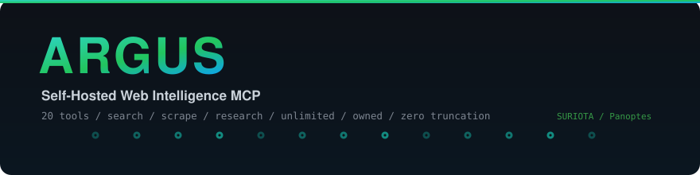
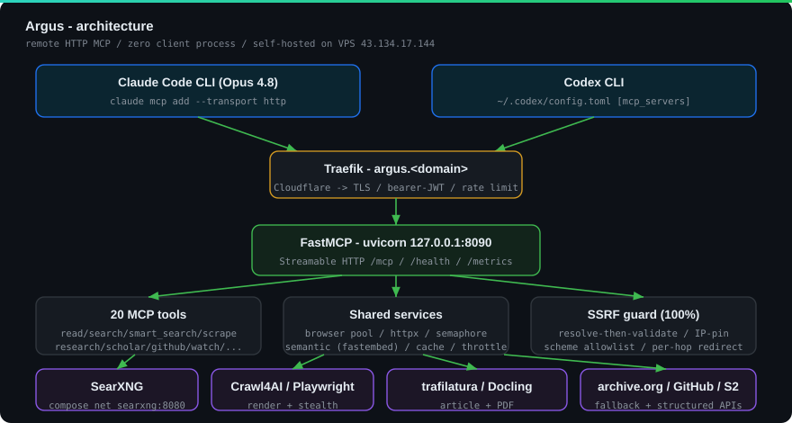

<div align="center">



<br/>

<a href="https://github.com/jlowin/fastmcp"></a>


<br/>


<br/><br/>

<!-- Dynamic repo-stat badges: render once the repo is PUBLIC (shields.io can't read private repos). -->


<br/><br/>


</div>

---

> **Argus Panoptes** - the all-seeing hundred-eyed giant. A self-hosted, **unlimited**, **owned** web **fetch / scrape / search** MCP server for **SURIOTA**. Mythological sibling to the **Hermes AI Server**. Every Claude Code / Codex CLI connects over **remote HTTP** -> **zero local process** on the client.

## Contents

- [Why Argus](#why-argus)
- [Architecture](#architecture)
- [The 20 tools](#the-20-tools)
- [Hard guarantees](#hard-guarantees)
- [Quickstart (local)](#quickstart-local)
- [Connect a CLI](#connect-a-cli)
- [Benchmarked](#benchmarked)
- [Repo map](#repo-map)
- [Status](#status)

## Why Argus

We surveyed the 12 leading paid/free web tools. **All** meter requests, truncate content, or cost money. Argus is built on best-in-class OSS, **self-hosted on the SURIOTA VPS** - so it is unlimited, free per-request, returns **full content (no truncation)**, and is **owned end-to-end**. It is **tools, not a brain**: the consuming agent (Claude Code's Opus 4.8 / Codex) does the reasoning - Argus needs **no LLM**.

| You were paying for... | Argus replaces it with... | Edge |
|---|---|---|
| Brave / Tavily / Exa **search** | `search` / `smart_search` (SearXNG, 70+ engines) | unlimited, multi-engine + **semantic rerank** |
| Jina Reader / Firecrawl **scrape** | `read` / `scrape` / `batch_read` / `crawl` | full content, JS render + stealth, **no truncation** |
| Jina / Firecrawl **PDF** | `read_pdf` (pymupdf4llm + Docling) | tables preserved (COT/FOMC) |
| Firecrawl **extract** / **map** | `extract_structured` / `map_urls` | CSS/XPath, sitemap discovery |
| Exa **findSimilar** / answer | `find_similar` / `research(deep)` | **local embeddings**, full-content bundle |
| - (no competitor self-hosts) | `github_search` / `scholar_search` / trading extractors / `watch` | structured GitHub / academic / FX moat |

## Architecture

<div align="center">

</div>

**Fetch strategy (cheap -> expensive):** httpx static -> trafilatura -> escalate to Crawl4AI/Playwright only when JS/thin -> Patchright stealth on anti-bot -> **Wayback archive** if the host is unreachable. Every hop is SSRF-guarded.

## The 20 tools

<details open>
<summary><b>Search &amp; discovery</b></summary>

<br/>

| Tool | What it does |
|---|---|
| `search` | Web search via SearXNG - categories (general/news/science/it), domain filters, safesearch, **hybrid lexical+semantic rerank**, recency boost, auto-backoff on throttle |
| `smart_search` | Auto-routes a query (deterministic, **no LLM**) -> github / scholar / news / it / general |
| `scholar_search` | Structured academic search (Semantic Scholar -> CrossRef): citations, DOI, abstract, OA-PDF |
| `github_search` | Structured GitHub `repositories`/`code`/`issues` + stars/language/sort |
| `map_urls` | Discover a site's URLs (sitemap.xml / robots.txt / 1-hop links) |
| `find_similar` | Semantically-related pages via **local embeddings** (Exa-style, no API) |

</details>

<details>
<summary><b>Fetch &amp; read</b></summary>

<br/>

| Tool | What it does |
|---|---|
| `read` | URL -> clean markdown/text/html, **no truncation**; `extract_media` adds links+images |
| `scrape` | JS-rendered fetch + screenshot/actions; auto-escalates to **Patchright stealth** on anti-bot |
| `batch_read` | Parallel `read` over many URLs, partial-failure tolerant |
| `read_pdf` | PDF -> markdown + tables (pymupdf4llm; `mode='quality'` -> Docling for scanned/complex) |
| `crawl` | Crawl4AI BFS deep-crawl, robots-respecting, domain-confined |
| `screenshot` | Full-page PNG capture of a rendered URL |

</details>

<details>
<summary><b>Extract &amp; research</b></summary>

<br/>

| Tool | What it does |
|---|---|
| `extract_structured` | Pull fields via CSS/XPath selectors (deterministic); optional LLM tier (`auto`/`llm`) |
| `research` | One-shot: `deep` (search -> full-read top-K -> bundle) / `quick` (hits) / `answer` (cited, opt-in LLM); `highlights`=top sentences per source; opt-in `max_chars_per_source` |

</details>

<details>
<summary><b>Monitoring &amp; trading moat</b></summary>

<br/>

| Tool | What it does |
|---|---|
| `watch` / `list_watches` / `unwatch` | Poll a page (full or selector) -> POST to a webhook (e.g. Telegram) on change |
| `forexfactory_calendar` | Economic calendar (FairEconomy JSON) -> Aurix `calendar_client` shape |
| `cot_report` | CFTC Commitments of Traders, structured |
| `news_sentiment_feed` | Ranked news + optional sentiment score |

> Trading parsers are validated to **>=99% field accuracy** (100% on golden files).

</details>

## Hard guarantees

- **SSRF** - resolve-then-validate, IP-pin anti-rebinding, scheme allowlist, per-hop redirect re-check, private/metadata/CGNAT deny -> **100% test coverage**, line + branch (hard gate).
- **No silent truncation** - full documents always; the streaming body cap is a DoS guard, not a content cap.
- **Tools never raise** - every tool returns a structured `err(code, msg, detail)` instead of crashing into the client.
- **Resilience** - content-addressed cache (per-source TTL, stale-serve), per-host courtesy delay + circuit breaker, archive egress-fallback.
- **Secure deploy** - bearer/JWT auth + nginx TLS + fail2ban; runs unprivileged via systemd; secrets via `EnvironmentFile`.

## Quickstart (local)

```bash
uv venv --python 3.12 && uv pip install -e ".[dev]"
crawl4ai-setup && crawl4ai-doctor          # one-time Chromium
# optional extras: ".[semantic]" (find_similar/rerank), ".[pdf-quality]" (Docling)

# SearXNG (search backend) - loopback only
cd deploy/searxng && docker compose up -d

python -m argus.server                      # stdio (local dev)
# or HTTP:  uvicorn argus.server:app --host 127.0.0.1 --port 8090
```

## Connect a CLI

Register with **Claude Code**:

```bash
claude mcp add --transport http argus https://argus.gifariksuryo.xyz/mcp \
  --header "Authorization: Bearer ${ARGUS_TOKEN}"
```

Register with **Codex** (`~/.codex/config.toml`):

```toml
[mcp_servers.argus]
url = "https://argus.gifariksuryo.xyz/mcp"
bearer_token_env_var = "ARGUS_TOKEN"
```

## Benchmarked

Head-to-head vs Claude Code & Codex **native** web tools (4-way, n=25, identical queries): **discovery parity**, but Argus wins decisively on **content depth** (full content per query vs hits/summaries), freshness, and cost/ownership. In-process `research()` runs in **3-6s** - Argus is not the latency bottleneck (CLI latency is the consuming agent + MCP transport). Claude+Argus stays token-neutral with the deepest synthesis; Codex+Argus trades +72% tokens for that depth. Semantic rerank quantified at **+27% nDCG** on conceptual queries. Full report: [`benchmark/RESULTS.md`](benchmark/RESULTS.md) ([harness](benchmark/README.md)).

## Repo map

| Path | What |
|---|---|
| `src/argus/` | the package - `server.py` (20 tools), `fetch/`, `extract/`, `security/ssrf.py`, `trading/`, `semantic.py`, `cache.py`, `watch.py` |
| `docs/` | [DESIGN](docs/00-DESIGN.md) / [RESEARCH](docs/01-RESEARCH.md) / [ROADMAP](docs/02-ROADMAP.md) / [TOOL-SPECS](docs/03-TOOL-SPECS.md) / [REFERENCES](docs/04-REFERENCES.md) / [COMPETITIVE-GAP](docs/05-COMPETITIVE-GAP.md) |
| `benchmark/` | [harness](benchmark/README.md) + [RESULTS](benchmark/RESULTS.md) + head-to-head |
| `deploy/` | systemd / nginx / provision.sh / fail2ban / [SECURITY-AUDIT](deploy/SECURITY-AUDIT.md) / [runbook](deploy/README.md) / searxng/ |
| root docs | [SOUL](SOUL.md) (identity) / [AGENTS](AGENTS.md) (agent guide) / [CHANGELOG](CHANGELOG.md) (history) |

## Status

**DEPLOYED LIVE.** Public HTTPS at **https://argus.gifariksuryo.xyz/mcp** (bearer auth) on the SURIOTA VPS (`103.172.172.29`, Ubuntu 24.04): uvicorn `127.0.0.1:8090 --workers 1` behind nginx + Let's Encrypt TLS + fail2ban; SearXNG docker on `127.0.0.1:8888`; `/health` + `/metrics` live. A systemd timer polls `main` every 5 minutes -> fast-forward only -> restart -> `/health` gate -> auto-rollback (and skips restart for docs/benchmark-only commits).

20 tools / **763 offline tests** (+ browser, slow, and network extras) green / **SSRF 100%** (line + branch) / ruff clean / security-audited (no Critical/High). Optional and off by default: the LLM tier (`ARGUS_ENABLE_LLM`) and local-path PDF (`ARGUS_ALLOW_LOCAL_PDF`). Only open owner input: set `ARGUS_S2_API_KEY` to enable `scholar_search`'s Semantic Scholar backend (CrossRef is the fallback). See [`docs/02-ROADMAP.md`](docs/02-ROADMAP.md).

<div align="center">
<sub>Built for <b>PT Surya Inovasi Prioritas (SURIOTA)</b> / self-hosted / unlimited / owned</sub>
</div>
