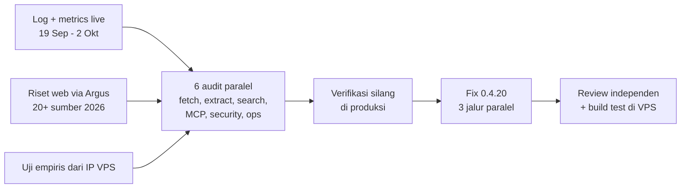

# Audit Gap Argus - 2 Oktober 2026

> [!NOTE]
> Audit menyeluruh Argus 0.4.19 terhadap landscape web-tooling Oktober 2026, data pemakaian
> live 13 hari, dan uji empiris dari IP VPS. Hasilnya dirilis sebagai **0.4.20**. Dokumen ini
> mencatat apa yang ditemukan, apa yang sudah diperbaiki, apa yang ditunda, dan apa yang
> ditolak beserta buktinya, supaya ronde berikutnya tidak mengulang riset yang sama.

## Daftar Isi

- [Metode](#metode)
- [Uji empiris dari IP VPS](#uji-empiris-dari-ip-vps)
- [Temuan kritis](#temuan-kritis)
- [Sudah diperbaiki di 0.4.20](#sudah-diperbaiki-di-0420)
- [Backlog berikutnya](#backlog-berikutnya)
- [Ditolak, dengan bukti](#ditolak-dengan-bukti)
- [Posisi terhadap kompetitor](#posisi-terhadap-kompetitor)

## Metode

- **Data pemakaian:** 1276 panggilan tool dalam 13 hari. Didominasi `search` (478) dan `read` (403), dengan beban riset berbahasa Indonesia (regulasi `peraturan.bpk.go.id`, harga produk untuk quotation, e-commerce lokal). Error sekitar 10%, terbesar `blocked_by_antibot` (47).
- **Riset eksternal:** spesifikasi MCP 2026-07-28, FastMCP 3/4, dua benchmark stealth-browser 2026, benchmark ekstraksi WCXB (2008 halaman), perbandingan parser PDF dan reranker 2026, kebijakan untrusted-content, serta Cloudflare Markdown for Agents.
- **Audit:** enam subagent read-only, satu per dimensi. Setiap temuan wajib menyertakan `file:line` dan bukti. Temuan kunci diverifikasi ulang di sesi utama, dan yang berisiko tinggi diuji langsung ke produksi.

## Uji empiris dari IP VPS

Klaim di internet diukur dari IP datacenter Tencent milik kita sendiri, karena reputasi IP adalah lapisan deteksi yang tidak diukur oleh benchmark mana pun.

| Uji | Hasil | Kesimpulan |
|---|---|---|
| httpx vs `curl_cffi` (impersonate Chrome) pada 14 situs yang diblokir | curl_cffi hanya memulihkan 2 (tokopedia, medium) | Dari IP ini yang dominan reputasi IP, bukan sidik jari TLS. Tier browser Argus sudah menembus kedua situs itu. |
| Wayback (`available`, `web`, `cdx`) | **429 konsisten** di ketiga endpoint | Fallback archive mati total dari IP ini: 0 dari 61 percobaan berhasil. Secara lokal (IP residensial) tetap berfungsi. |
| Common Crawl CDX | 504 setelah sekitar 10 detik, URL tidak ditemukan | Tidak layak jadi fallback live. |
| StackExchange API | 200 | Jalur pemulihan untuk StackOverflow, yang memblokir HTML dari IP ini. |
| OpenAlex API | 200 | Sumber scholar alternatif tanpa key. |
| `Accept: text/markdown` ke zona Cloudflare | `text/markdown` 17 KB | Berfungsi, tapi hanya di zona yang mengaktifkannya. |
| fastembed batch 48 vs 8 | +1005 MB vs +263 MB RSS, kecepatan sama | Akar masalah RSS 2.7 GB, diperbaiki di 0.4.19. |
| **Redirect publik ke `http://searxng:8080/config`** | **Konfigurasi internal 108 KB dikembalikan** | SSRF tier browser terbukti, lihat bawah. |

## Temuan kritis

> [!CAUTION]
> **SSRF di tier browser (terkonfirmasi di produksi, diperbaiki 0.4.20).** Hanya URL awal
> yang divalidasi. Chromium mengikuti redirect, subresource, dan `fetch()` dari JavaScript
> ke host internal: service compose, metadata Tencent `169.254.x`, dan jaringan Easypanel.
> Sekarang Chromium wajib melewati egress proxy loopback (`security/egress.py`): setiap
> koneksi (hop redirect, subresource, `fetch()` dari JS, WebSocket) divalidasi dengan
> validator SSRF yang sama, lalu di-dial ke IP yang tervalidasi. Chromium tidak lagi
> me-resolve DNS sendiri, jadi DNS rebinding ikut tertutup.
>
> **Koreksi diri:** percobaan pertama memakai handler route Playwright. Test offline lulus,
> tapi saat image diserang langsung, redirect tetap lolos, karena Playwright hanya
> meneruskan request pertama dari rantai redirect ke handler. Pendekatan itu dibuang. Test
> proxy sekarang memakai socket sungguhan.

> [!WARNING]
> **Pool koneksi dipakai ulang lintas hostname (diperbaiki 0.4.20).** Pin IP dulu dilakukan
> dengan menulis ulang host URL ke IP. Akibatnya httpcore memakai satu socket TLS untuk semua
> hostname di belakang IP CDN yang sama, sehingga request ke host B lewat sesi TLS host A
> (403 palsu, dan sertifikat B tidak pernah dicek). Efek sampingnya, `final_url` berisi IP.
> Pin sekarang dilakukan saat connect lewat network backend httpcore.

Temuan penting lain:

- **Setiap error terlihat sukses bagi klien:** `isError` tidak pernah diset. Ada 127 error yang tampil sebagai panggilan berhasil.
- **Test berjalan di stack yang berbeda dari produksi:** fastmcp 3.4.2 lokal vs 4.0.10 di prod, dan tidak ada lockfile.
- **Ekstraksi CPU memblokir satu-satunya event loop:** trafilatura, PyMuPDF, dan ONNX. Ini menjelaskan kenapa p99 `research` 223 detik melewati batas 120 detik.
- **Pencarian metadata tanggal memakan 31-43 detik per halaman listing besar**, dan mengarang tanggal dari footer "Copyright 2019".
- **`_dedup_blocks` O(n^3):** 16 detik untuk 4000 blok.
- **`language=en` dikirim untuk semua query**, termasuk yang berbahasa Indonesia.
- **`read_pdf(mode="tables")` mengembalikan nol tabel** dengan pymupdf4llm 1.28 (mode layout).

## Sudah diperbaiki di 0.4.20

Keamanan dan supply chain

- [x] Egress proxy SSRF untuk setiap koneksi browser (normal, stealth, crawl), terverifikasi dengan serangan langsung ke image hasil build.
- [x] Pin IP di level connect: `final_url` kembali ke hostname, pool per hostname, SNI dan sertifikat benar.
- [x] `requirements.lock` dengan hash, dikunci ke versi yang berjalan di produksi. Base image Python dan SearXNG di-pin per digest.
- [x] Batas fan-out: `research.max_sources` maksimal 10, konkurensi `batch_read` maksimal 16.
- [x] `/health` publik hanya mengembalikan status; telemetri penuh hanya untuk loopback.
- [x] `watch` dibatasi 50; URL webhook disamarkan di `list_watches` (token bot Telegram).
- [x] INSTRUCTIONS menyatakan semua konten hasil fetch adalah data tak tepercaya.
- [x] Container `mem_limit: 3g` dan `no-new-privileges`.
- [x] Floor `pymupdf4llm>=1.28` (pymupdf-layout 1.27 berlisensi PolyForm NonCommercial).

Protokol MCP

- [x] `isError` diset untuk semua hasil `err()`.
- [x] Annotations (`readOnlyHint`, `openWorldHint`, `destructiveHint`) untuk ke-20 tool.
- [x] `anthropic/maxResultSizeChars` 500k untuk tool konten, supaya klien tidak memotong.
- [x] `stateless_http=True`: redeploy tidak lagi memutus sesi.
- [x] `scrape.actions` bertipe `list[str]` (snippet JS); `scrape` tidak lagi mengembalikan HTML mentah sebagai markdown.
- [x] Satu sumber versi (`__version__` = pyproject = `serverInfo`).

Ekstraksi dan PDF

- [x] `_dedup_blocks` hampir linear: 4000 blok dari 16.6 detik turun ke 0.003 detik, perilaku identik (diuji 3000 input acak).
- [x] `extract_metadata(extensive=False)`: 31.3 detik turun ke 0.7 detik, tanpa tanggal karangan.
- [x] Fallback balanced pass bila hasil precision tipis (kurang dari 150 kata).
- [x] JSON-LD Product/Offer ke `metadata.structured` (harga, mata uang, ketersediaan, SKU); tanggal dan penulis Article.
- [x] `metadata.lang` dari `<html lang>`.
- [x] `metadata.pages_without_text` di semua jalur PDF; argumen pymupdf4llm yang diabaikan dihapus; `find_tables(use_layout=False)` memulihkan mode tables.
- [x] Pesan pymupdf diarahkan ke logging, bukan stdout (stream JSON-RPC pada transport stdio).

Search, research, scholar, router

- [x] Tidak ada default `language=en`; SearXNG `auto` yang berlaku.
- [x] `include_domains` dikirim sebagai `site:` ke SearXNG, bukan sekadar filter belakang.
- [x] Retry menghitung ulang engine, jadi engine yang baru di-bench tidak dipakai lagi.
- [x] `research`: batas per sumber `min(50, timeout/2)`, deadline 90%, mengembalikan bundle parsial (`degraded_reason: budget_exhausted`) alih-alih membuang semuanya.
- [x] Filter `year_from` dan `open_access` dikirim ke backend (S2 dan CrossRef).
- [x] Router memahami token Indonesia (berita, terbaru, jurnal, penelitian, skripsi) dan tahun polos tidak lagi memaksa rute news.

Operasional

- [x] Semua kerja CPU dipindah dari event loop (`asyncio.to_thread`; PDF lewat satu thread bersama karena PyMuPDF tidak thread-safe).
- [x] `/metrics`: `_count` dan `_sum` kumulatif; `cache.hit` / `cache.miss`; `fetch.browser_ssrf_blocked`.
- [x] Dockerfile: layer dependency sebelum `COPY src`, jadi push kode tidak mengunduh ulang sekitar 1 GB.
- [x] GitHub Actions: test offline di setiap push (dari lockfile yang sama) dan cek uptime `/health` tiap 30 menit (gagal berarti email).

## Backlog berikutnya

| Prioritas | Item | Alasan | Biaya |
|---|---|---|---|
| ~~P1~~ | ~~Tier stealth benar-benar Patchright (`UndetectedAdapter`)~~ | **Ditolak di 0.4.21 setelah diukur:** 4/12 vs 5/12, blokir terjadi dalam 0.3 s sebelum JS jalan (keputusan di level IP) | - |
| ~~P1~~ | ~~UA browser sesuai versi Chromium~~ | **Ditunda:** alasan yang sama, sidik jari tidak berpengaruh dari IP ini | - |
| [x] P1 | Set evaluasi Indonesia (`benchmark/semantic_id.yaml`, 32 query, 22 Indonesia) | **Selesai 0.4.21**; subset WCXB offline masih terbuka | M |
| [x] P1 | Embedder multilingual (`paraphrase-multilingual-MiniLM-L12-v2`) | **Selesai 0.4.21:** AUC Indonesia 0.894 -> 0.960, ambang 0.40/0.60 | +400 MB RSS |
| [x] P1 | Pemulihan Chromium yang mati | **Selesai 0.4.21:** relaunch sekali di bawah lock, `/health` melaporkan browser mati | S |
| [x] P1 | Container non-root | **Selesai 0.4.21:** uid 10001, volume baru `argus-data` | S-M |
| [x] P2 | Kode error `dns_failed` terpisah dari `ssrf_blocked` | **Selesai 0.4.22**: retry hanya EAI_AGAIN, timeout 8 s | S |
| [x] P2 | Adapter API resmi: StackExchange, OpenAlex | **Selesai 0.4.21:** StackOverflow terbaca lewat API dari VPS; OpenAlex di antara S2 dan CrossRef | S-M |
| [x] P2 | Negative cache untuk URL yang diblokir | **Selesai 0.4.22**: hanya baca biasa yang kena anti-bot; `scrape` selalu dicoba ulang | S |
| [x] P2 | Skip Wayback dari IP ini | **Selesai 0.4.22**: cooldown 30 menit setelah 429/403/503, alasan dicatat | S |
| [x] P2 | `request_timeout` SearXNG 3 detik dan cooldown bertingkat | **Selesai 0.4.22**: diukur, engine responsif menjawab 0.01-1.1 s | S |
| [x] P2 | Literal enum untuk parameter bernilai tetap | **Selesai 0.4.22**: 9 enum di schema | S |
| [x] P2 | Screenshot sebagai content Image | **Selesai 0.4.22** (breaking: base64 tidak lagi di structuredContent) | S |
| [x] P2 | Fence nonce untuk mode answer | **Selesai 0.4.22**: tag acak per panggilan | S |
| [x] P3 | `crawl(same_domain=False)`; batas ekstraksi PDF | **Selesai 0.4.22**: link lintas domain ke host internal sudah ditolak egress proxy (0.4.20); PDF dibatasi 300 halaman termasuk rentang eksplisit | S-M |
| [x] P3 | Kode `<pre>`, `<ol>`, tabel tanpa `<th>` | **Selesai 0.4.22**: bahasa fence, `<pre>` satu baris, separator tabel (`<ol>` sudah benar di trafilatura 2.2) | M |

## Ditolak, dengan bukti

| Opsi | Bukti | Keputusan |
|---|---|---|
| `curl_cffi` sebagai tier baru | Hanya 2 dari 14 dari IP VPS, dan keduanya sudah tertembus tier browser | Tunda; hanya menghemat latensi |
| Camoufox, nodriver/zendriver | Plus 250-700 MB per instance; reputasi IP tetap jadi plafon | Tolak sampai ada data dari Patchright yang asli |
| Common Crawl / archive.today sebagai fallback | 504 setelah 10 detik / CAPTCHA untuk IP datacenter | Tolak |
| Cross-encoder reranker multilingual | 1.1 GB, kira-kira menggandakan p50 search | Tolak untuk sekarang |
| MinerU-HTML, Docling di image | Butuh GPU / torch berukuran GB | Tolak; Docling tetap ekstra opsional |
| BrowseComp-Plus, SimpleQA | Butuh agent atau LLM judge, padahal tier LLM sengaja mati | Tolak; pakai set evaluasi Indonesia |
| OpenTelemetry | Tidak ada collector di server | Tolak |
| MCP Tasks extension | Butuh Docket dan dukungan klien | Tunda |
| Proxy residensial | Aturan pemilik: tidak ada layanan berbayar | Tolak |

## Posisi terhadap kompetitor

Argus tetap unggul di konten penuh tanpa pemotongan, tanpa biaya per request, kepemilikan penuh, dan extractor trading. Gap fitur dari dokumen Juni (`docs/05-COMPETITIVE-GAP.md`) sudah hampir semua terpenuhi. Gap yang tersisa bukan fitur baru, melainkan:

1. **Keamanan sebagai layanan publik**, yang ditutup di 0.4.20.
2. **Kualitas untuk beban kerja Indonesia** (bahasa query, embedder, set evaluasi).
3. **Dinding reputasi IP datacenter**, yang tidak bisa diatasi tool apa pun tanpa proxy, sehingga jalur realistisnya adalah API resmi per situs.

Copyright 2026 PT Surya Inovasi Prioritas (SURIOTA).
